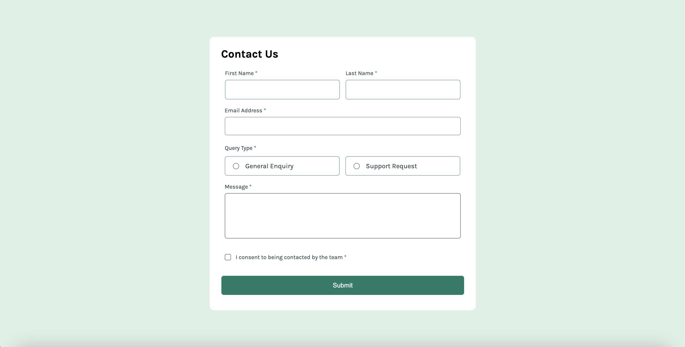

# Frontend Mentor - Contact form solution

This is a solution to the [Contact form challenge on Frontend Mentor](https://www.frontendmentor.io/challenges/contact-form--G-hYlqKJj). Frontend Mentor challenges help you improve your coding skills by building realistic projects. 

## Table of contents

- [Overview](#overview)
  - [The challenge](#the-challenge)
  - [Screenshot](#screenshot)
  - [Links](#links)
- [My process](#my-process)
  - [Built with](#built-with)
  - [What I learned](#what-i-learned)
  - [Continued development](#continued-development)
- [Author](#author)

## Overview

### The challenge

Users should be able to:

- Complete the form and see a success toast message upon successful submission
- Receive form validation messages if:
  - A required field has been missed
  - The email address is not formatted correctly
- Complete the form only using their keyboard
- Have inputs, error messages, and the success message announced on their screen reader
- View the optimal layout for the interface depending on their device's screen size
- See hover and focus states for all interactive elements on the page

### Screenshot
The goal is to make something  with all the functionality listed above that looks similar to the following screenshot:

The following is my version:

### Links

- Solution URL: [Solution URL here](https://www.frontendmentor.io/solutions/contact-form-challenge-ramagall-myJ4WKQNHr)
- Live Site URL: [Live site URL here](https://ramagall.github.io/contact-form-ramagall/)

## My process

### Built with

- Semantic HTML5 markup
- CSS custom properties
- Flexbox
- CSS Grid
- Mobile-first workflow
- Javascript

### What I learned

I learned quite a bit more above responsive design. This time I focused on making sure every element I added was responsive before working on the next and I think it really paid off in the final result. 

### Continued development

I want to contiue to learn more about responsive design (this will likely be a proccess I work on forever), and I want to improve my Javascript skills to write better and better code. 

## Author
- Frontend Mentor - [@ramagall](https://www.frontendmentor.io/profile/ramagall)
- GitHub - [@ramagall](https://www.https://github.com/ramagall)

